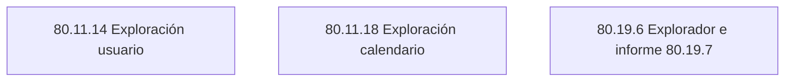
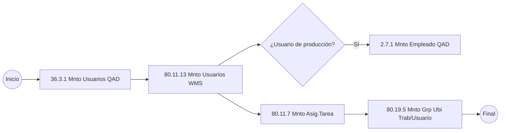

# Crear usuario WMS

El siguiente diagrama representa el proceso de creación de usuario en WMS. Para crear un usuario en WMS este primero debe de estar creado como usuario en __QAD 36.3.1__.

Si el usuario de WMS que estamos creando es un usuario que realiza declaración de productos terminados. Este además debe estar creado como empleado en __QAD 2.7.1__.

### __Mantenimiento Usuario (80.11.13)__

1. Para poder crear un usuario en MNTO Usuario en WMS, este debe de estar creado primero en QAD __(36.3.1)__.

    

    |Campo      |Descripción                         |
    |-----------|------------------------------------|
    |ID usu     |Debe ingresar el ID del usuario     |
    |Descripción|Ingresar una descripción del usuario|

    

    

    |Campo      |Descripción                         |
    |-----------|------------------------------------|
    |Tarea      |Son todas las tareas que puede realizar el usuario __(COUNT, PACK, PICK, PUT-AWAY, RECOUNT, REPLEN, TRANSFER)__.|
    |Tipo       |Es el tipo de transcción que puede realizar cada usuario.|
    |Ruta interna|Es la ruta que tiene cada usuario según las tareas ya antes asignadas __(PICKING, PUT-STOR, RCTPT, TRANSFER)__.|
    |Descripción|Se ingresa una descripción de lo antes creado.|

### __Exploración Usuario (80.11.14)__

1. En este explorador podemos visualizar a los usuarios y sus respectivas tareas, además del tipo de transacción y sus rutas internas.

    

### __Mantenim asignación tarea (80.11.7)__

1. En esta pantalla se le asignan a cada usuario los tipos de tarea que pueden ejecutar.

    

### __Exploración asignación tarea (80.11.8)__

1. En este explorador podemos visualizar las tareas que tienen asignadas cada usuario

    

### __Mantenedor grupo ubicación trabajo- usuario (80.19.5)__

1. Esta opción es para asignarle a un usuario un grupo de lugar de trabajo, y también para configurar las opciones de impresión específicas para este usuario.

    

    |Campo      |Descripción                         |
    |-----------|------------------------------------|
    |Alm        |Introduzca un almacén para el grupo de usuarios y lugar de trabajo.|
    |Depósito   |Introduzca el nombre del **Warehouse (BM100)** para el grupo de usuarios y el lugar de trabajo.|
    |Grpo ubic trab|Introduzca el lugar de trabajo del grupo para vincular al usuario. **(Grúa o Transpaleta)**.|
    |ID usu     |Introduzca el ID de usuario de el usuario para vincular al grupo lugar de trabajo.|

    

    **En esta pantalla solo ingresaremos el Gusto como tipo “B”.**

    |Campo      |Descripción                         |
    |-----------|------------------------------------|
    |Gusto      |Introduzca el código para definir el estilo y el formato de las pantallas de radiofrecuencia que se utilizara para mostrar información.|
    |Dispos     |Introduzca el código para definir el dispositivo para ser usado, como un RF/RDT terminal, dentro de este grupo de lugar de trabajo, en su caso. Si no hay ningún código de dispositivo único es aplicable, deje este campo en blanco.|
    |Impres dispos externo|Introduzca el código de la impresora que se debe utilizar para el dispositivo externo.|
    |Impres form|Introduzca el código de la impresora formulario.|
    |Impreso ID |El marco de impresión contiene campos que controlan la impresión de detalles de la transacción.|
    |Impres asign|Introduzca el código de la impresora de tareas, o selecciones un código de la lista desplegable.|
    |Insp impres |El marco de impresión contiene campos que controlan la impresión de detalles de la transacción.|
    |¿Usar externo?|Introduzca el código de la impresora de tareas, o seleccione un código de la lista desplegable.|

### __Exploración grupo ubicación trabajo-usuario (80.19.6)__

1. En esta opción se puede visualizar los grupos de ubicación de trabajo- usuario.

    

